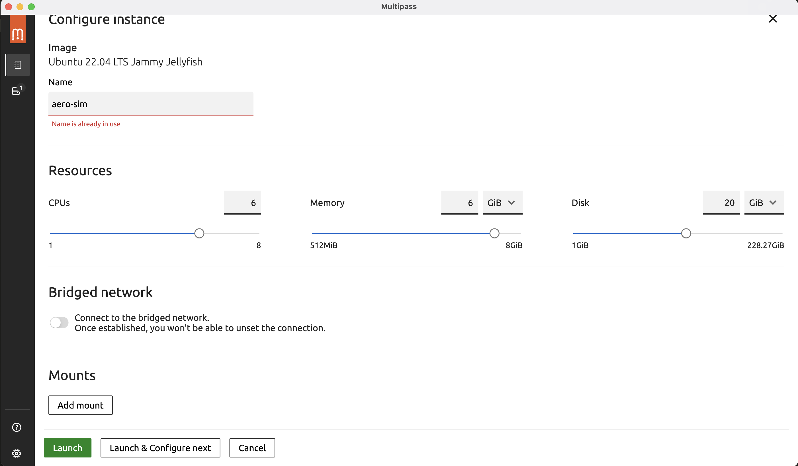

# Setting up simulation environment

The simulation environment tools only work in Linux and hence a VM / dual boot is required. We will be using Ubuntu 22.04.

- For Windows users it is suggested to dual boot for good simulation performance, otherwise WSL works too (run all the linux instructions inside the VM). Make sure you use WSL2.

- Mac users (M1, M2, M3, M4) have to use a VM as dual boot is not possible. Install Multipass from [https://canonical.com/multipass](https://canonical.com/multipass). Also install `brew`.


## Make the VM (skip if using dual boot)
- Windows users make a WSL VM of Ubuntu22.04
- Mac users make a new 22.04 VM. (Please keep the VM name `aero-sim` and don't tick Bridged Network. Keep the storage 20GB)

. To write commands into this VM run in the terminal
```bash
multipass shell aero-sim
```
I will use the term Linux terminal (for writing commands into this multipass shell, WSL for windows users) and Mac terminal (for writing commands in the normal Mac terminal). Type `exit` and hit enter to exit the Linux terminal.
Also note the IP address of you VM by running
```bash
multipass list
```
in the MAC terminal. The IP should look like `192.168.64.x` (most probably `192.168.64.2`).


## Install ROS 2
Paste the following lines in the Linux terminal
```bash
sudo apt-get update && sudo apt-get upgrade -y
sudo apt-get install -y wget git sudo python3-pip python3-dev software-properties-common curl tzdata keyboard-configuration

# Locale
sudo apt update && sudo apt install locales -y
sudo locale-gen en_US en_US.UTF-8
sudo update-locale LC_ALL=en_US.UTF-8 LANG=en_US.UTF-8
export LANG=en_US.UTF-8

# ROS 2 repo
sudo apt update
sudo apt install software-properties-common -y
sudo add-apt-repository universe -y
sudo apt install curl -y
sudo curl -sSL https://raw.githubusercontent.com/ros/rosdistro/master/ros.key -o /usr/share/keyrings/ros-archive-keyring.gpg
echo "deb [arch=$(dpkg --print-architecture) signed-by=/usr/share/keyrings/ros-archive-keyring.gpg] http://packages.ros.org/ros2/ubuntu $(. /etc/os-release && echo $UBUNTU_CODENAME) main" | sudo tee /etc/apt/sources.list.d/ros2.list > /dev/null
sudo apt update
sudo apt install ros-humble-desktop ros-dev-tools -y
source /opt/ros/humble/setup.bash
echo "source /opt/ros/humble/setup.bash" >> ~/.bashrc
```


## Install Gazebo
Paste the following in the Linux terminal
```bash
sudo curl https://packages.osrfoundation.org/gazebo.gpg \
  --output /usr/share/keyrings/pkgs-osrf-archive-keyring.gpg
echo "deb [arch=$(dpkg --print-architecture) signed-by=/usr/share/keyrings/pkgs-osrf-archive-keyring.gpg] \
  http://packages.osrfoundation.org/gazebo/ubuntu-stable $(lsb_release -cs) main" \
  | sudo tee /etc/apt/sources.list.d/gazebo-stable.list > /dev/null

sudo apt update
sudo apt install gz-harmonic -y
```

Mac users additionally have to install gazebo in their Mac machine too. Run this in the Mac Terminal (one by one)
```bash
brew install --cask xquartz
xcode-select --install # If this gives error that you have already installed then just go ahead with the next step
brew install python3
brew tap osrf/simulation
brew install gz-harmonic
```


## ROS Gazebo Bridge
Run the following in the Linux terminal
```bash
sudo rosdep init
sudo wget https://raw.githubusercontent.com/osrf/osrf-rosdep/master/gz/00-gazebo.list \
  -O /etc/ros/rosdep/sources.list.d/00-gazebo.list
rosdep update

mkdir -p ~/ros_gz_ws/src
cd ~/ros_gz_ws/src
git clone https://github.com/gazebosim/ros_gz.git -b humble

cd ~/ros_gz_ws
export GZ_VERSION=harmonic

rosdep install -r --from-paths src -i -y --rosdistro humble

# Limit parallelism — critical on ARM or it will OOM
export MAKEFLAGS="-j 1"
colcon build --parallel-workers 1
source ~/ros_gz_ws/install/setup.bash
echo "source ~/ros_gz_ws/install/setup.bash" >> ~/.bashrc
```
This will take around 10 minutes to compile


## Ardupilot
Run the following in the Linux terminal
```bash
cd ~
git clone --recurse-submodules https://github.com/ArduPilot/ardupilot.git
cd ardupilot
Tools/environment_install/install-prereqs-ubuntu.sh -y
```


## Ardupilot Gazebo Plugin
Run in the linux terminal
```bash
sudo apt update
sudo apt install libgz-sim8-dev rapidjson-dev -y
sudo apt install libopencv-dev libgstreamer1.0-dev libgstreamer-plugins-base1.0-dev gstreamer1.0-plugins-bad gstreamer1.0-libav gstreamer1.0-gl -y
sudo apt update
sudo apt install libdebuginfod1 libdebuginfod-dev -y

mkdir -p ~/gz_ws/src && cd ~/gz_ws/src
git clone https://github.com/ArduPilot/ardupilot_gazebo
export GZ_VERSION=harmonic
cd ardupilot_gazebo
mkdir build && cd build
cmake .. -DCMAKE_BUILD_TYPE=RelWithDebInfo
make -j4
```

Now WSL/Dual Boot guys run
```bash
export GZ_SIM_SYSTEM_PLUGIN_PATH=$HOME/gz_ws/src/ardupilot_gazebo/build
export GZ_SIM_RESOURCE_PATH=$HOME/gz_ws/src/ardupilot_gazebo/models
echo 'export GZ_SIM_SYSTEM_PLUGIN_PATH=$HOME/gz_ws/src/ardupilot_gazebo/build' >> ~/.bashrc
echo 'export GZ_SIM_RESOURCE_PATH=$HOME/gz_ws/src/ardupilot_gazebo/models' >> ~/.bashrc
```

Mac people will run in the Linux terminal [Replace x with the IP you noted initially]
```bash
echo "mkdir -p /tmp/gz_models" >> ~/.bashrc
echo "cp -r ~/gz_ws/src/ardupilot_gazebo/models /tmp/gz_models" >> ~/.bashrc
echo "export GZ_SIM_SYSTEM_PLUGIN_PATH=$HOME/gz_ws/src/ardupilot_gazebo/build" >> ~/.bashrc
echo "export GZ_SIM_RESOURCE_PATH=/tmp/gz_models/models" >> ~/.bashrc
echo "export GZ_PARTITION=aero-sim" >> ~/.bashrc
echo "export GZ_IP=192.168.64.x" >> ~/.bashrc
echo "export GZ_RELAY=192.168.64.1" >> ~/.bashrc
source ~/.bashrc
```
And on the MAC terminal run
```bash
mkdir -p ~/gz_ws/src && cd ~/gz_ws/src
git clone https://github.com/ArduPilot/ardupilot_gazebo
echo "mkdir -p /tmp/gz_models" >> ~/.zshrc
echo "cp -r ~/gz_ws/src/ardupilot_gazebo/models /tmp/gz_models" >> ~/.zshrc
echo "export GZ_SIM_RESOURCE_PATH=/tmp/gz_models/models" >> ~/.zshrc
echo "export GZ_PARTITION=aero-sim" >> ~/.zshrc
echo "export GZ_IP=192.168.64.1" >> ~/.zshrc
echo "export GZ_RELAY=192.168.64.x" >> ~/.zshrc
source ~/.zshrc
```


## Final Test
Install QGroundControl on your machine [https://qgroundcontrol.com/](https://qgroundcontrol.com/) and open it.

WSL/Linux run the following in a terminal.
```bash
cd ~
git clone https://github.com/abhishekjain1612006/AeroClub-SLAM.git
cd AeroClub-SLAM
gz sim -r -v4 world.sdf
```
and open another linux terminal and run
```bash
sim_vehicle.py -v ArduCopter -f gazebo-iris --frame JSON # This command will compile the ArduPilot codebase the first time you run it
```


Mac people must open a linux terminal and run
```bash
cd ~
git clone https://github.com/abhishekjain1612006/AeroClub-SLAM.git
cd AeroClub-SLAM
gz sim -s -r -v4 world.sdf
```
In another linux terminal run
```bash
sim_vehicle.py -v ArduCopter -f gazebo-iris --frame JSON --out=udp:192.168.64.1:14550
```
and in the MAC terminal run
```bash
gz sim -v4 -g
```


You should see "Ready to Fly" on the QGC after a while and a gazebo world with a house model and a drone sitting in it. You can try sending takeoff and land commands to the drone using the QGC.
